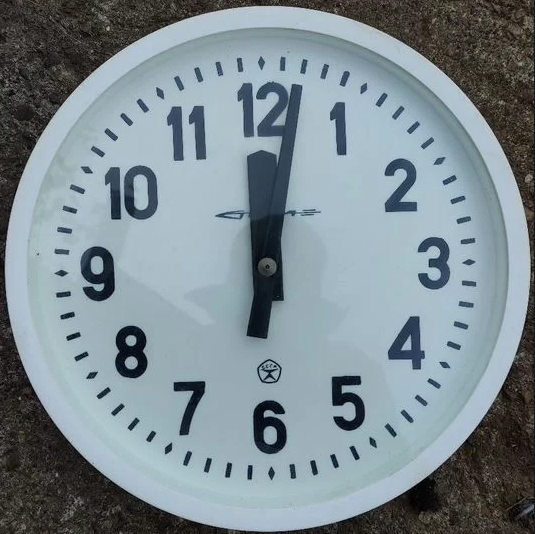
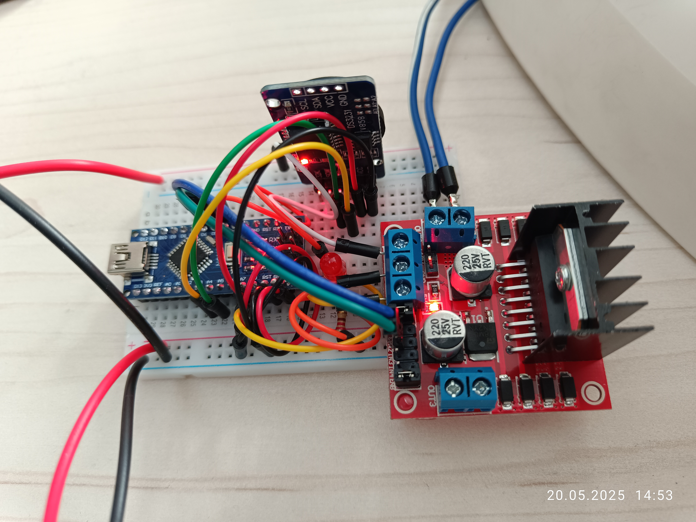
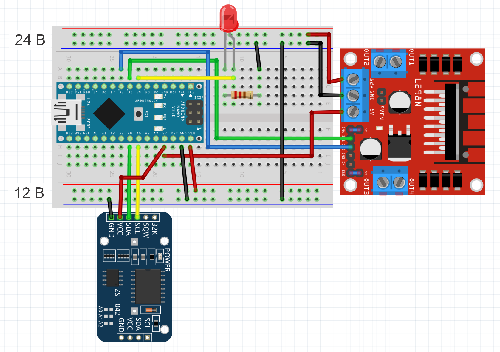
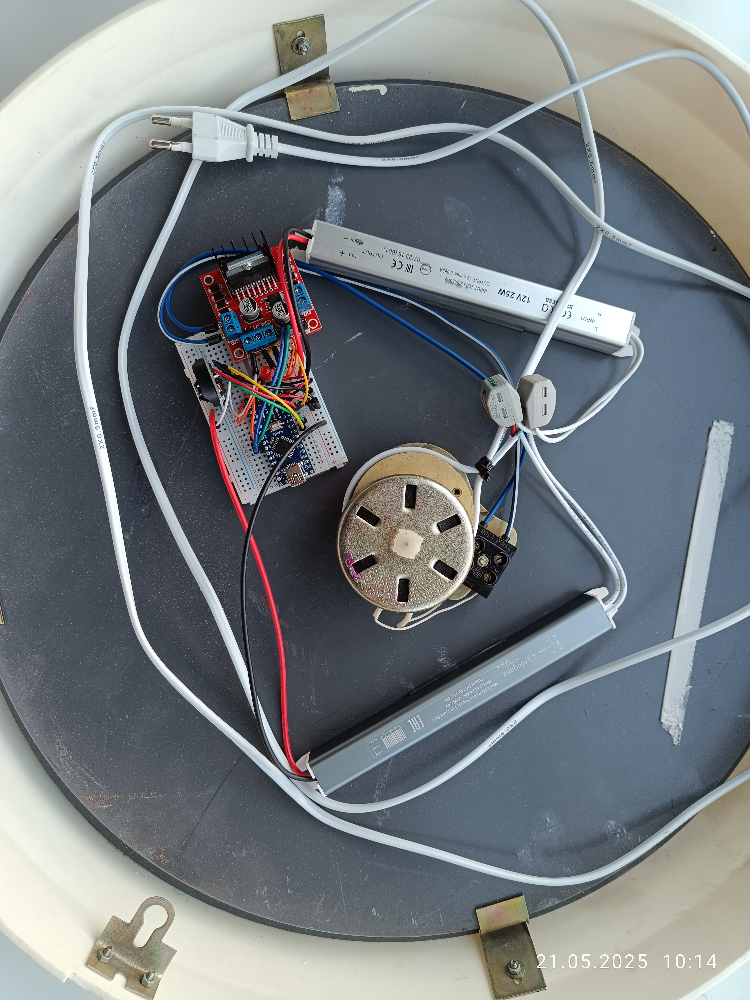

Arduino Clock Driver with DS3231 RTC
Первичные часы на Ардуино с DS3231 RTC
⏰ Arduino Clock Driver | DS3231 + L298N | 🔄 Polarity switching | 💡 D4 LED | 📜 MIT License
⏰ Первичные часы на Ардуино | DS3231 + L298N | 🔄 Смена полярности | 💡 D4 Светодиод | 📜 Лицензия MIT

Проект точного управления электромеханическими часами через Arduino с автоматической сменой полярности импульсов.

## 📋 Содержание
- [Особенности](#-особенности)
- [Общее описание](#-общее-описание)
- [Аппаратные компоненты](#-аппаратные-компоненты)
- [Документация](#-документация)
- [Ввод в работу](#-ввод-в-работу)
- [Заключение](#-заключение)

## 🌟 Особенности
- ⏱ Высокоточный хронометраж (±2ppm) RTC DS3231
- 🔄 Автоматическая смена полярности каждую минуту
- ⚡ Поддержка силовых драйверов L298N (12V/24V)
- 💡 Визуальная индикация состояния (D4)
- 📅 Длительная работа без обслуживания

## 📝 Общее описание

- 🔴 Красный
- Данный проект разработан для ввода в строй вторичных часов "Стрела".
- Вторичные часы "Стрела", как и любые другие вторичные часы советского производства, не имеют в своём составе задаюшего тактового генератора (первичные часы), который обеспечивает выдачу импульсов на механизм передвижения стрелок. В составе вторичных часов имеется только соленоид электромагнитного привода стрелок и передаточный шестерёнчатый механизм.
- Особенностью работы механизма привода стрелок вторичных часов "Стрела" является то, что импульсы, поступающие на соленоид привода, должны менять свою полярность при каждой подаче напряжения, что реализовано в коде.
- В данном проекте не используется аккумулятор в RTC-модуле, т.к. на часах имеются только часовая и минутная стрелки и хранить дату и время в модуле не нужно. По сути, модуль DS3231 используется как высокоточный счётчик секунд с термокомпенсацией. Проверка корректности показаний модуля и сброс в случае необходимости  реализованы в коде. Использование в проекте RTC-модулей без термокомпенсации не рекомендуется. 
- Краткое описание работы устройства:
  - После загрузки проверяется состояние RTC-модуля, в случае определения некорректных данных даты и времени происходит автоматический сброс на 2000:1:1:00:00:00. В случае неисправности модуля или отсутствия связи с ним, светодиод, подключенный к пину D4 Arduino, мигает с частотой два раза в секунду в бесконечном цикле до перезагрузки системы. При пропадании связи с RTC-модулем в процессе работы часы останавливаются, однозначно сигнализируя о неисправности. 
  - Программа два раза в секунду проверяет состояние "секунд", выдаваемых RTC-модулем, когда это состояние становится равным "00", на исполнительный механизм часов через силовой блок L298N выдаётся импульс напряжения 24 В (о чём свидетельствует кратковременное включение светодиода подключенного к пину D4 Arduino), длительностью одну секунду. Длительность подаваемого импульса подбирается таким образом, чтобы обеспечить чёткое срабатывание механизма часов и может быть изменена программно. Выставлять длительность подаваемого импульса более одной секунды не рекомендуется, во избежание ненужного нагрева силовых и индуктивных элементов системы.  

## 🛠 Аппаратные компоненты
| Компонент               | Количество | Примечание                                |
|-------------------------|------------|--------------------------------           |
| Arduino Nano            | 1          | Любая совместимая версия                  |
| Модуль DS3231           | 1          | С аккумулятором LIR2032. (Необязательно)  |
| Драйвер L298N           | 1          | С радиатором                              |
| Блок питания 12V        | 1          | Для логической части                      |
| Блок питания 24V        | 1          | Для часового механизма                    |
| Светодиод               | 1          | Индикация срабатывания                    |
| Резистор 220 Ом         | 1          | Для светодиода                            |

## ✅ Документация

- Прототипированная плата с компонентами (скриншот из Fritzing).
- При монтаже особое внимание следует уделить перемычкам на модуле L298N.
  - Перемычки 5V -- ENA и 5V -- ENB должны быть установлены.
  - Перемычка 5V -- EN должна быть снята.
- [Проект Fritzing (.fzz)](./documents/fritz_project.fzz)
- [Скетч (.ino)](./sketch/sketch.ino)
- [Скетч (.txt)](./sketch/sketch.txt)
- [Проект на одном листе (.pdf)](./documents/one_page.pdf)
- [Проект на одном листе (.vsdx)](./documents/one_page.vsdx)
- [Паспорт часов (.pdf)](./documents/passport_strela.pdf)
- [Техническая спецификация DS3231 (.pdf)](./documents/ds3231.pdf)
- [Техническая спецификация L298N (.pdf)](./documents/l298.pdf)

## 🚨 Ввод в работу

- После подачи питания, либо перезагрузки с кнопки на Arduino, устройство выдаёт первый импульс примерно через две секунды. Не факт, что этот импульс приведёт к срабатыванию стрелочного механизма часов, т.к. в этот момент соленоид привода может уже находиться в сработанном положении для данной полярности импульса. Поэтому сначала нужно выяснить на каком положении минутной стрелки происходит старт. Варианта всего два - это чётные или нечётные минуты.
- Порядок запуска:
  - Определить с каких минут, чётных или нечётных, происходит запуск часов с первого импульса, поочередно выставляя минутную стрелку на чётные и нечётные минуты и перезагружая Arduino.
  - Допустим, старт происходит с чётных минут и время выставлено на 12:30 (при обесточенной схеме), далее, нужно дождаться контрольного времени 12:30:58 и подать на схему питание.
  - Всё, ввод в работу осуществлён.

## 🎯 Заключение
- Следует понимать что успех реализации проекта зависит в том числе и от состояния механизма самих часов. Если механизм находится в неудовлетворительном состоянии (грязь, ржавчина), то возможны пропуски хода, нечёткое срабатывание и прочие неполадки. 
- Устройство не требует обслуживания, интернет для работы также не требуется.
- Потребляемый соленоидом привода ток составляет 22-24мА, что вполне позволяет увеличить автономность системы, используя источники энергии не связанные с электрической сетью. При этом будет целесообразно минимизировать длительность управляющего импульса до минимальной величины, достаточной для чёткого срабатывания механизма часов. 
